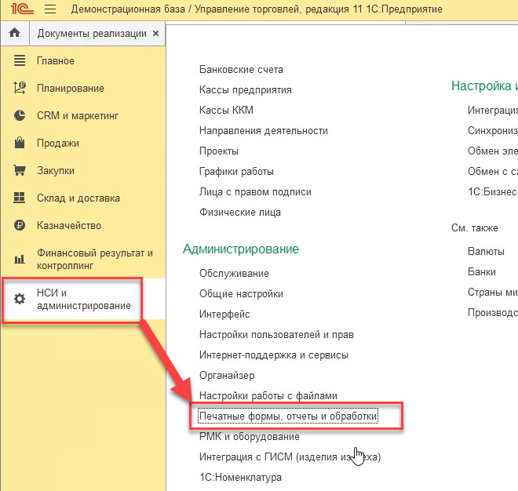
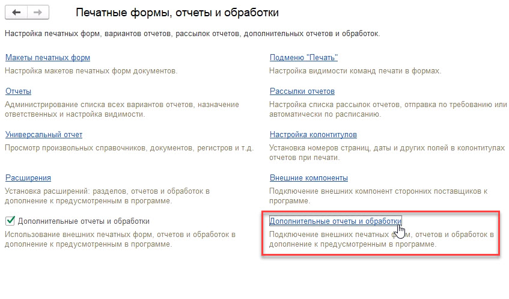
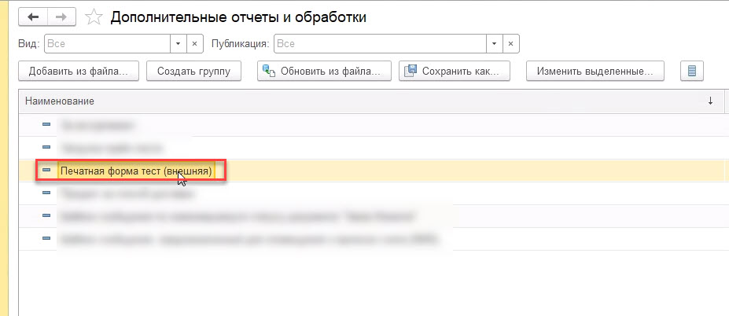
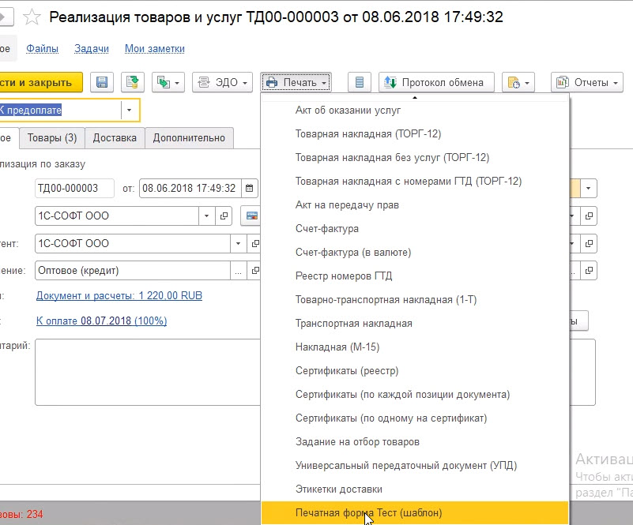
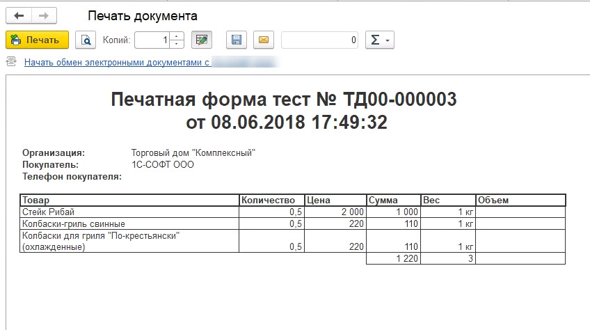

<h3>Печатная форма пример (шаблон) для УТ 11.3</h3>  
Для того чтобы добавить печатную форму в конфигурацию(УТ 11.3), необходимо зайти "НСИ и администрирование" -> "Печатные формы, отчеты и обработки"  
  
Далее "Дополнительные отчеты и обработки". Добавляем печатную форму в список обработок.  
  
Далее, заходим в любой документ "Реализация товаров и услуг" и нажимаем на кнопку "Печать", находим в конце списка печатных форм - нашу тестовую.   
  
  
И вот результат: 
  
Тестировалось на: 
1С:Предприятие 8.3 (8.3.18.1128) 
Управление торговлей, редакция 11 (11.4.13.51)  
